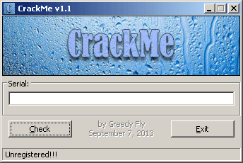
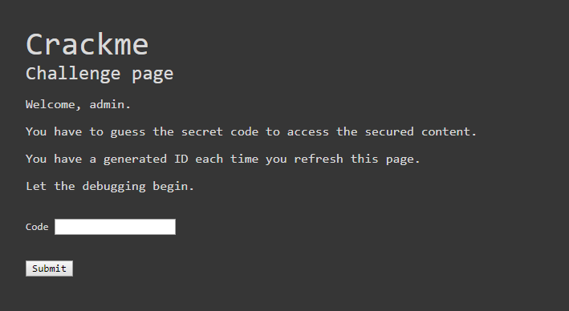

# Section 3 - Debugging d'une application web

On va passer aux choses sérieuses avec le debugging d'une application web sous Django 2.1,
et on ne va pas traiter de n'importe quelle type d'application: on va tenter de résoudre un **crackme** !

Les **crackmes** (ou *crackez-moi*) sont des petites applications utilisées pour s'entraîner sur le domaine du cracking, le plus souvent en explorant un dump assembleur et en comprenant ce qu'il se passe en détails, dans le but de trouver un code secret, trouver l'algorithme qui génère les codes secrets ou bien casser une protection.



Evidemment on va pas voir d'assembleur ou de bytecode (bien qu'il est possible d'afficher le bytecode de n'importe quelle fonction en Python à l'aide du module `dis` et de la fonction `dis.dis`), mais le principe est le même. Sans se servir d'un éditeur de code, on va explorer le déroulement du code et trouver les codes secrets pour entrer dans la partie sécurisée de l'application.

Le code est dans le dossier `examples/3-debugging-web`.

## 1. Préparation de l'application

Sans oublier le virtualenv, allez dans le dossier de l'exemple:

```bash
# Appliquer les migrations
> python manage.py migrate

# Démarrer le runserver
> python manage.py runserver
```

Vous pouvez maintenant ouvrir le navigateur à l'adresse [http://localhost:8000](http://localhost:8000).
Si tout va bien, vous voyez une page de login (qui fait aussi page d'enregistrement).

Choisissez un nom d'utilisateur et un mot de passe pour accéder à la page du challenge.



Vous pouvez tenter tous les mots de passe que vous voulez, normalement vous ne devriez pas pouvoir passer.

Une première solution peut être d'ouvrir les outils développeurs du navigateur et de voir ce qu'il se passe. Vous pouvez essayer, et voir si vous trouvez le moyen d'accéder à la page sécurisée.

Vous pouvez ensuite stopper le runserver avec *CTRL+C*.

## 2. Placer des breakpoints dans le code

Contrairement à l'application CLI, on ne va pas utiliser la commande `python -m ipdb`. A la place, on va directement placer des breakpoints dans le code à l'aide du one-liner:

```python
import ipdb; ipdb.set_trace()
```

Placez ce one-liner au tout début de la fonction `login` du fichier `crackme/views.py`, puis lancez le runserver avec des paramètres supplémentaires:

```bash
> python manage.py runserver --nothreading --noreload

# Vous pouvez aussi utiliser la commande custom 'debug-runserver' mise à disposition dans cet exemple
```

Le paramètre `nothreading` spécifie qu'il n'y aura qu'une seule connexion concurrente au maximum sur le serveur, et `noreload` désactive le rechargement automatique du serveur suite à la modification d'un fichier source.

Pourquoi désactiver ces fonctionnalités ? A cause de `pdb`. Si plusieurs accès se font sur le serveur lors du debugging, vous allez être spammés avec les logs du serveur pendant votre session. Et vous allez faire bugguer `pdb` si le code se recharge en plein milieu d'une session.

Donc c'est parti, on recharge la page de login sur [http://localhost:8000/login](http://localhost:8000/login).

> La page charge sans s'arrêter ? C'est normal. On a suspendu la récupération du contenu de la page.

Si vous regardez votre shell, on voit qu'on est dans le code de la fonction `login`:

```text
> c:\...\coding-dojo\cd1-debugging\examples\3-debugging-web\crackme\views.py(20)login()
     19
---> 20     errors = {}
     21

ipdb> _
```

Avec **ll**, vous pouvez retrouver le code, et faire du step-by-step en utilisant **n**, jusqu'à la fonction `render`. Via **pp**, vous pouvez afficher le contenu de n'importe quelle variable dans le scope, comme `request`, `context`, les composantes de `request` comme les `COOKIES`, `META` et d'autres choses encore.

```text
ipdb> pp request.user
<SimpleLazyObject: <django.contrib.auth.models.AnonymousUser object at 0x000002993E8B12E8>>
```

Dans cet extract, on voit qu'on est pas encore connecté (instance de `AnonymousUser`). On peut ensuite continuer l'exécution avec **c**, et normalement la page devrait finir de charger dans le navigateur.

Tentez de vous connecter avec de nouveaux credentials et vous pourrez voir le détail de chaque opération dans le debugger, qui se remettera en pause lors de la validation. Mettez un breakpoint à la ligne *25*, juste après l'appel à `form.is_valid()`, ou allez-y via **n**.
Avec **pp**, vous pouvez récupérer les données contenues dans le formulaire *validé* via l'attribut `cleaned_data`.

```text
ipdb> pp form.cleaned_data
{'existing': True,
 'password': 'admin',
 'user': <User: admin>,
 'username': 'admin'}
ipdb> _
```

Vous pouvez explorer si vous voulez, puis continuer avec **c** pour permettre au navigateur de récupérer la réponse.

Vous pouvez stopper le serveur et enlever le one-liner de la fonction login.

> Attention: il y a un défaut assez gênant dans l'utilisation de pdb avec runserver: il peut arriver que vous n'ayez plus la main sur le serveur (à cause de pdb) et vous ne pourrez pas transmettre d'input au serveur pour l'éteindre, la fermeture du terminal restant l'option la plus simple.  
> Pour bypass ce problème, il suffit de CTRL+C, puis rouvrir une session pdb en passant sur la ligne de debug et de quitter le pdb ouvert avec *q*.

## 3. Récupérer le code

On va tenter de récupérer le code. Placez le one-liner de debug au début de la fonction `check_code` du fichier `views.py`. Et relancez le serveur.

Une fois sur la page de challenge, entrez n'importe quoi et appuyez sur *Submit*. Le shell devrait réagir et finir sur *pdb*.

```text
> c:\...\coding-dojo\cd1-debugging\examples\3-debugging-web\crackme\views.py(64)check_code()
     63
---> 64     hexcode = request.session.get("generated_hex")
     65     passcode = request.POST.get("code")

ipdb> _
```

Faites **n** deux fois pour atterir sur la ligne 67. On va analyser un peu ce qu'il se passe.
On peut commencer par observer le contenu de `hexcode` et de `passcode`.

```text
ipdb> p hexcode
'HbhaWEjLHEJjcwNiRrsVFkuvksWzhZJy'
ipdb> p passcode
'toto'
ipdb> _
```

Sur la ligne 67, on voit un appel à une fonction `generate_code` qui prend le `hexcode` en paramètre.

D'ici on a deux solutions:
  - soit on step dans la fonction de génération, on comprend comment elle fonctionne et on craft notre propre code en fonction de notre *hexcode*
  - soit on s'en fout, on génère un code avec cette même fonction, on l'écrit sur un bout de papier et on se connecte avec
  
On va prendre la deuxième option, hop:

```text
ipdb> pp generate_code(hexcode)
'EVJTEEVJ-QEEVBQEE-BBQETBBQ-QTBBVQTB'
ipdb> _
```

> Attention: le hexcode change à chaque chargement de la page de challenge.

Bon, on note le code, on continue l'exécution avec **c** et on essaye de se connecter depuis le navigateur.

On entre le code, on valide, et bim on retourne dans le shell où on peut s'assurer via **n** que le test de code est bien valide et qu'on renvoie un code *204*. *tada*


## 4. Bonus

Comme présenté sur le screenshot précédent, vous pouvez tenter d'accéder à la page [/bonus](http://localhost:8000/bonus). Sur erreur, vous êtes redirigé sur la page de challenge. Bonne chance !

> - 1er indice: c'est juste une histoire de décorateur (debut du labyrinthe `decorators.py:11`).  
> - 2e indice: le 3e décorateur est plus piège, il faut trouver une valeur qui n'est pas égale à elle-même. Il me semble que c'est un certain nombre qui peut faire l'affaire (a moins que ça ne soit pas un nombre ?)

<hr />

Et voilà, c'est fini pour aujourd'hui ! Vous devriez plutôt bien gérer *pdb* maintenant.

<p style="float: left">
  <a href="./2-DEBUGGING-CLI.html">< Debugging d'une application CLI</a>
</p>
